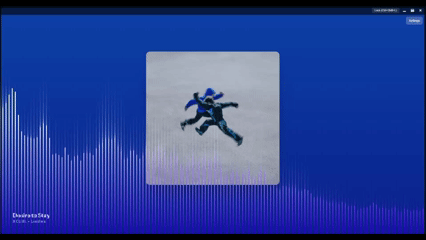

  

<h1 align="center">Visage</h1>

  A lightweight, transparent desktop music visualiser that reacts to your system audio in real time.

  <strong>Built with React, Canvas, and Tauri V2</strong>

---

<!-- Option A: GIF -->

  

<!-- Option B: Video link -->
<!--
[▶️ Watch demo video](https://github.com/yourname/visage-widget/assets/XXXXX/demo.mp4)
-->

---

## Features

- Real-time audio-reactive visualiser
- Fully transparent window (overlay-style)
- Click-through / lockable window mode
- Customisable visualiser settings
  - Bar width, spacing, smoothing, bass boost
  - Colour-configurable gradients
- Lightweight native desktop app

---

## Tech Stack

### Frontend
- React
- TypeScript
- Tailwind CSS
- HTML Canvas (custom visualiser)

### Desktop / Backend
- Tauri (Rust)
- CPAL (system audio capture)

### Tooling
- Vite
